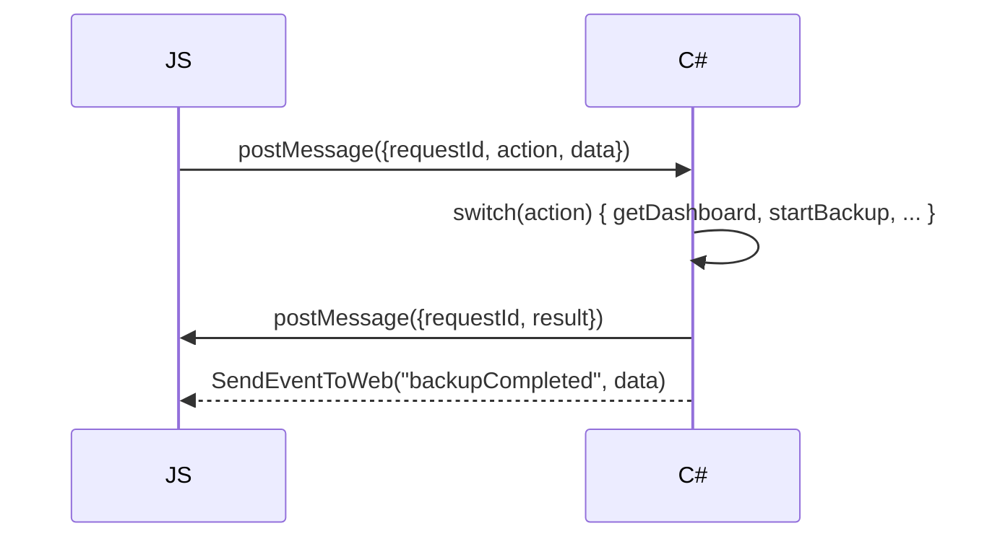

<div align="center">

# BackupApp

**Automated backup with intelligent schedule calculation and distributed LAN delivery**

[](https://dotnet.microsoft.com/)
[](https://learn.microsoft.com/en-us/dotnet/csharp/)
[](https://www.microsoft.com/windows)
[](https://learn.microsoft.com/en-us/dotnet/desktop/winforms/)
[](LICENSE)

</div>

---

## Table of Contents

- [1. General Information](#1-general-information)
- [2. Functional Requirements](#2-functional-requirements)
- [3. Architecture](#3-architecture)
- [4. Key Algorithms](#4-key-algorithms)
- [5. JSON Serialization](#5-json-serialization)
- [6. Security](#6-security)
- [7. WebMessage API](#7-webmessage-api)
- [8. Frontend](#8-frontend)

---

## 1. General Information

### Purpose

A desktop application for automated backup of selected folders with intelligent schedule calculation and distributed copying to multiple target PCs on a local network.

### Target Platform

| Parameter      | Value                        |
|----------------|------------------------------|
| Language       | C# 12                        |
| Framework      | .NET 8                       |
| Type           | WinForms + WebView2          |
| OS             | Windows 10 1803+ / Windows 11|
| Architecture   | x64                          |

### Technology Stack

| Component          | Technology                                       |
|--------------------|--------------------------------------------------|
| UI Engine          | WebView2 (Chromium Edge)                         |
| Frontend           | Vanilla JS (SPA), HTML5, CSS3                    |
| Communication      | JSON-RPC via `CoreWebView2.WebMessageReceived`   |
| Archiving          | `System.IO.Compression.ZipFile` / `ZipArchive`   |
| Scheduler          | `System.Threading.Timer` + `BackupSchedulerService`|
| Network            | SMB (`System.IO`), ICMP (`Ping`)                 |
| Settings Storage   | JSON (`System.Text.Json`) + DPAPI for passwords  |
| Logging            | Serilog (File)                                   |
| DI                 | `Microsoft.Extensions.DependencyInjection`       |

---

## 2. Functional Requirements

### 2.1. Source Management

- Adding source folders via native `FolderBrowserDialog`
- File/mask exclusions (e.g. `*.tmp`, `node_modules/`)
- Compression level (0–9) and AES-256 password configuration
- Enable/disable source

### 2.2. Schedule Calculation

- Schedule modes: `Daily`, `Weekly`, `Monthly`, `Interval`, `OnChange`, `Smart`
- Intelligent analysis: scan 7-day change history, recommend interval
- Calendar showing scheduled (orange) and completed (green) backups
- Skip if no changes (`SkipIfNoChanges`)
- Smart calculation (`UseSmartCalculation`)

### 2.3. Archiving

- ZIP format (`System.IO.Compression`)
- Streaming archive (no full RAM load)
- AES-256 encryption via `ZipArchive` with `EncryptionAlgorithm.Aes256`
- Naming: `Backup_SourceName_yyyyMMdd_HHmmss.zip`
- Progress via `IProgress<BackupProgress>`

### 2.4. Distributed Copying

- N target PCs (no hard limit)
- Addressing by IP or hostname
- Network path `\\IP\Share\Path`
- Availability check: ICMP ping + `Directory.Exists`
- Parallel transfer to all PCs (limited by `MaxParallelTransfers`)
- Retry up to N times with delay
- Pending transfer queue when PC is unavailable (check every 5 min)
- Windows credentials or explicit login/password (DPAPI)
- SHA256 checksum after transfer
- Atomic write: `.tmp` → rename

### 2.5. Storage and Retention

- Policy: `KeepLastN` + `KeepDays` (separate for local and each target PC)
- SHA256 checksum of archive after creation
- Local storage (optional)

### 2.6. Monitoring and Notifications

- Dashboard: statistics (total backups, successful, next backup, active PCs)
- Calendar with markers
- Recent backups (table)
- Recent events (log)
- Pending queue (undelivered transfers)
- Windows toast notifications
- Email notifications (SMTP, optional)
- Event log with level filter and search
- Log export to CSV/JSON

---

## 3. Architecture

### 3.1. Project Structure

```
BackupApp/                          # monolith, single .csproj
├── AppSettings.cs                  # Root configuration model
├── Program.cs                      # Entry point (UI / --scheduler / --remove-scheduler)
├── MainForm.cs                     # WinForms host with WebView2
├── MainForm.Designer.cs
│
├── Models/
│   ├── BackupSource.cs
│   ├── Schedule.cs                 # ScheduleType enum
│   ├── TargetPC.cs
│   ├── BackupResult.cs             # BackupStatus enum
│   ├── BackupProgress.cs
│   ├── TransferProgress.cs
│   ├── TargetTransferResult.cs
│   ├── PendingTransfer.cs
│   ├── LogEntry.cs                 # LogLevel enum
│   ├── DashboardData.cs
│   ├── WebMessageRequest.cs
│   └── RetentionPolicy.cs
│
├── Interfaces/
│   ├── IBackupEngine.cs
│   ├── IScheduleCalculator.cs
│   ├── ITargetTransferService.cs
│   ├── IRetentionManager.cs
│   ├── ISettingsService.cs
│   ├── INotificationService.cs
│   ├── IDashboardService.cs
│   └── ILogService.cs
│
├── Services/
│   ├── BackupEngine.cs             # Archiving (Zip)
│   ├── BackupOrchestrator.cs       # Coordination: archive → transfer → queue
│   ├── BackupSchedulerService.cs   # Timer scheduler
│   ├── SmartScheduleCalculator.cs  # Change analysis + GetNextRunTime
│   ├── TargetTransferService.cs    # SMB transfer + retry + SHA256 + retention
│   ├── RetentionManager.cs        # Cleanup old backups
│   ├── SettingsService.cs         # JSON + DPAPI
│   ├── LogService.cs              # Serilog + in-memory buffer
│   ├── DashboardService.cs        # Statistics collection for dashboard
│   └── NotificationService.cs     # Toast + Email
│
├── Utils/
│   ├── CryptoHelper.cs            # DPAPI Protect/Unprotect, SHA256
│   └── JsonHelper.cs              # JsonSerializerOptions + ScheduleTypeJsonConverter
│
├── wwwroot/
│   ├── index.html
│   ├── css/main.css
│   └── js/app.bundle.js           # SPA frontend
│
├── appsettings.json
├── uninstall-service.bat
├── .gitignore
└── backup_app_tech_spec.md
```

### 3.2. Launch Modes

| Argument             | Mode                                                   |
|----------------------|--------------------------------------------------------|
| *(no arguments)*     | Full UI application + built-in scheduler               |
| `--scheduler`        | Background scheduler process (no UI)                   |
| `--remove-scheduler` | Remove task from Windows Task Scheduler                |

On first UI launch, creates a Windows Task Scheduler entry (requires admin rights):

```shell
schtasks /create /tn "BackupAppScheduler" /tr "\"<exe>\" --scheduler" /sc onlogon /f
```

### 3.3. C# ↔ JavaScript Communication



- **Request-response:** `api.call(action, data)` → Promise
- **Events:** `SendEventToWeb` → `api.on('backupCompleted', cb)`
- `ComVisible(true)` HostObject for `FolderBrowserDialog`

---

## 4. Key Algorithms

### 4.1. Intelligent Schedule Calculation

1. Scan files over N days
2. Group by hour
3. Select interval based on average frequency:

| Changes/hour | Interval   |
|--------------|------------|
| > 50         | 1 h        |
| 10–50        | 4 h        |
| 1–10         | 24 h       |
| < 1          | 168 h (wk) |

4. Determine "hot hours" → recommend start time
5. If interval 24 h → `ScheduleType.Daily`, if 168 h → `ScheduleType.Weekly`

### 4.2. Handling Target PC Unavailability

1. `TransferAsync` → retry up to `Network.RetryCount` times
2. All attempts exhausted → `PendingTransfer` in `pending_queue.json`
3. `BackupOrchestrator` checks queue every 5 min
4. On success — remove from queue
5. Maximum 10 attempts per transfer

### 4.3. Scheduled Backup

- Timer fires every 30 seconds
- Checks all schedules: if `GetNextRunTime` ≤ now → starts backup
- Re-entrancy lock via `ConcurrentDictionary<Guid, bool>`
- Skip if `SkipIfNoChanges` and `HasChangesSince == false`

---

## 5. JSON Serialization

All JSON operations use a single `JsonHelper.Options` with `ScheduleTypeJsonConverter`:

- **Read:** string (`"Daily"`) → `ScheduleType.Daily`; number (`0`) → `ScheduleType.Daily`
- **Write:** number (`0`–`5`)
- `PropertyNameCaseInsensitive = true`
- `PropertyNamingPolicy = CamelCase`

---

## 6. Security

- Passwords stored via `System.Security.Cryptography.ProtectedData` (DPAPI)
- Format: `DPAPI|base64-encrypted`
- SHA256 checksums for archives and transferred files
- AES-256 archive encryption (optional)

---

## 7. WebMessage API

| Action              | Data                         | Result                          |
|---------------------|------------------------------|---------------------------------|
| `getDashboard`      | —                            | `DashboardData`                 |
| `getSources`        | —                            | `List<BackupSource>`            |
| `addSource`         | `BackupSource`               | `List<BackupSource>`            |
| `removeSource`      | `{id}`                       | `List<BackupSource>`            |
| `updateSource`      | `BackupSource`               | `List<BackupSource>`            |
| `getSchedules`      | —                            | `List<Schedule>`                |
| `saveSchedule`      | `Schedule`                   | `List<Schedule>`                |
| `calculateSchedule` | `{path}`                     | `Schedule` (recommendation)     |
| `getTargets`        | —                            | `List<TargetPC>`                |
| `addTarget`         | `TargetPC`                   | `List<TargetPC>`                |
| `updateTarget`      | `TargetPC`                   | `List<TargetPC>`                |
| `removeTarget`      | `{id}`                       | `List<TargetPC>`                |
| `checkTarget`       | `{id}`                       | `bool` (availability)           |
| `startBackup`       | `{sourceId}`                 | `{message}`                     |
| `getLogs`           | `{count, level?, search?}`   | `List<LogEntry>`                |
| `getPendingTransfers`| —                           | `List<PendingTransfer>`         |
| `processQueue`      | —                            | `{processed}`                   |
| `getSettings`       | —                            | `AppSettings`                   |
| `saveSettings`      | `AppSettings`                | `AppSettings`                   |
| `exportConfig`      | —                            | `{path}`                        |
| `importConfig`      | —                            | `AppSettings`                   |
| `pickFolder`        | —                            | `{path}`                        |
| `estimateSize`      | `{path}`                     | `{size, fileCount}`             |
| `getAppVersion`     | —                            | `{version, framework}`          |

---

## 8. Frontend (SPA)

Single `app.bundle.js` — ~930 lines. Components:

| Component          | Description                                  |
|--------------------|----------------------------------------------|
| **ApiClient**      | JSON-RPC wrapper (postMessage / addEventListener) |
| **AppState**       | Global state + listeners                     |
| **Router**         | SPA router (6 pages)                         |
| **CalendarWidget** | Calendar with scheduled/backup dates         |
| **dashboard**      | Statistics, calendar, queue, recent backups/events |
| **sourceManager**  | CRUD sources                                 |
| **scheduleEditor** | Schedule editor + calendar                   |
| **targetManager**  | CRUD target PCs                              |
| **logViewer**      | Log with filter + auto-refresh 5s            |
| **settingsView**   | Application settings                         |

### Pages

| Route        | Name         |
|--------------|--------------|
| `dashboard`  | Dashboard    |
| `sources`    | Sources      |
| `schedule`   | Schedule     |
| `targets`    | Targets      |
| `logs`       | Event Log    |
| `settings`   | Settings     |

Dark/light theme via CSS variables. Language: Russian/English.

---

## Installation

<p align="center">
  <a href="../installer_output/BackupApp_Setup_1.0.exe" style="display:inline-block;padding:14px 32px;background:#0078D4;color:#fff;border-radius:8px;text-decoration:none;font-size:18px;font-weight:600;">📥 Download BackupApp v1.0</a>
</p>

### Requirements

- Windows 10 1803+ / Windows 11
- [WebView2 Runtime](https://developer.microsoft.com/en-us/microsoft-edge/webview2/) (installed automatically if missing)
- .NET 8 Runtime (included in the installer)
