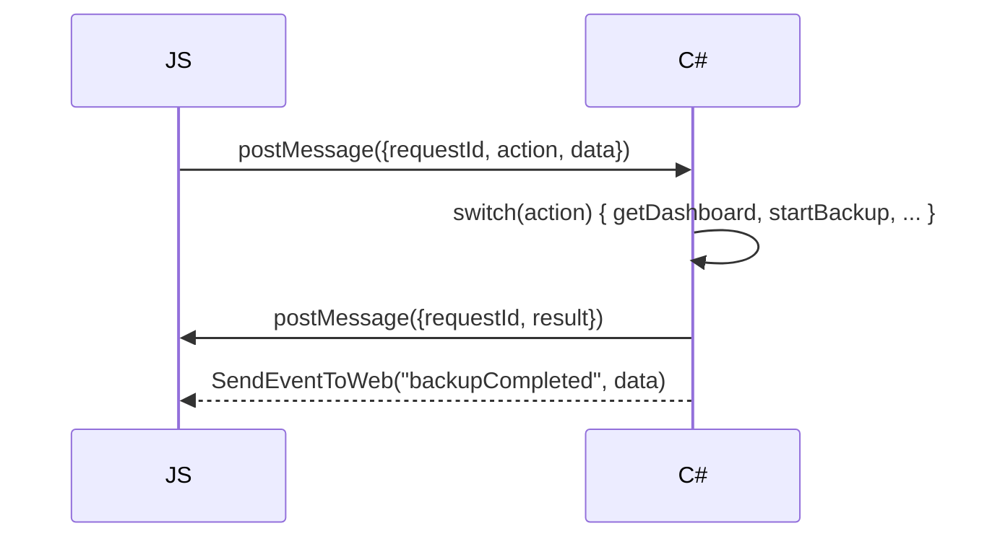

<div align="center">

# BackupApp

**Автоматизированное резервное копирование с интеллектуальным расчётом графика и распределённой доставкой в LAN**

[](https://dotnet.microsoft.com/)
[](https://learn.microsoft.com/en-us/dotnet/csharp/)
[](https://www.microsoft.com/windows)
[](https://learn.microsoft.com/en-us/dotnet/desktop/winforms/)
[](LICENSE)

</div>

---

## Содержание

- [1. Общие сведения](#1-общие-сведения)
- [2. Функциональные требования](#2-функциональные-требования)
- [3. Архитектура](#3-архитектура)
- [4. Ключевые алгоритмы](#4-ключевые-алгоритмы)
- [5. JSON-сериализация](#5-json-сериализация)
- [6. Безопасность](#6-безопасность)
- [7. WebMessage API](#7-webmessage-api)
- [8. Фронтенд](#8-фронтенд)

---

## 1. Общие сведения

### Назначение

Настольное приложение для автоматизированного резервного копирования выбранных папок с интеллектуальным расчётом графика и распределённым копированием на несколько целевых ПК в локальной сети.

### Целевая платформа

| Параметр       | Значение                     |
|----------------|------------------------------|
| Язык           | C# 12                        |
| Фреймворк      | .NET 8                       |
| Тип            | WinForms + WebView2          |
| ОС             | Windows 10 1803+ / Windows 11|
| Архитектура    | x64                          |

### Технологический стек

| Компонент          | Технология                                      |
|--------------------|-------------------------------------------------|
| UI-движок          | WebView2 (Chromium Edge)                        |
| Фронтенд           | Vanilla JS (SPA), HTML5, CSS3                   |
| Коммуникация       | JSON-RPC через `CoreWebView2.WebMessageReceived`|
| Архивация          | `System.IO.Compression.ZipFile` / `ZipArchive`  |
| Планировщик        | `System.Threading.Timer` + `BackupSchedulerService`|
| Сеть               | SMB (`System.IO`), ICMP (`Ping`)                |
| Хранение настроек  | JSON (`System.Text.Json`) + DPAPI для паролей   |
| Логирование        | Serilog (File)                                  |
| DI                 | `Microsoft.Extensions.DependencyInjection`      |

---

## 2. Функциональные требования

### 2.1. Управление источниками

- Добавление папок-источников через нативный `FolderBrowserDialog`
- Исключение файлов/масок (например `*.tmp`, `node_modules/`)
- Настройка уровня сжатия (0–9) и пароля AES-256
- Включение/отключение источника

### 2.2. Расчёт графика

- Режимы расписания: `Daily`, `Weekly`, `Monthly`, `Interval`, `OnChange`, `Smart`
- Интеллектуальный анализ: сканирование истории изменений за 7 дней, рекомендация интервала
- Календарь с отображением запланированных (оранжевый) и выполненных (зелёный) бэкапов
- Пропуск, если не было изменений (`SkipIfNoChanges`)
- Умный расчёт (`UseSmartCalculation`)

### 2.3. Архивация

- Формат ZIP (`System.IO.Compression`)
- Потоковая архивация (без загрузки всего в RAM)
- Шифрование AES-256 через `ZipArchive` с `EncryptionAlgorithm.Aes256`
- Именование: `Backup_ИмяИсточника_yyyyMMdd_HHmmss.zip`
- Прогресс через `IProgress<BackupProgress>`

### 2.4. Распределённое копирование

- N целевых ПК (без жёсткого лимита)
- Адресация по IP или hostname
- Сетевой путь `\\IP\Share\Path`
- Проверка доступности: ICMP ping + `Directory.Exists`
- Параллельная передача на все ПК (ограничение `MaxParallelTransfers`)
- Retry до N раз с задержкой
- Очередь отложенных передач при недоступности ПК (проверка каждые 5 мин)
- Учётные данные Windows или явные логин/пароль (DPAPI)
- SHA256 контрольная сумма после передачи
- Атомарная запись: `.tmp` → rename

### 2.5. Хранение и ротация

- Политика: `KeepLastN` + `KeepDays` (для локального и каждого целевого ПК отдельно)
- SHA256 контрольная сумма архива после создания
- Локальное хранение (опционально)

### 2.6. Мониторинг и уведомления

- Дашборд: статистика (всего бэкапов, успешных, следующий бэкап, активные ПК)
- Календарь с отметками
- Последние бэкапы (таблица)
- Последние события (лог)
- Очередь ожидания (недоставленные передачи)
- Toast-уведомления Windows
- Email-уведомления (SMTP, опционально)
- Журнал событий с фильтром по уровню и поиском
- Экспорт лога в CSV/JSON

---

## 3. Архитектура

### 3.1. Структура проекта

```
BackupApp/                          # monolith, один .csproj
├── AppSettings.cs                  # Корневая модель конфигурации
├── Program.cs                      # Точка входа (UI / --scheduler / --remove-scheduler)
├── MainForm.cs                     # WinForms-хост с WebView2
├── MainForm.Designer.cs
│
├── Models/
│   ├── BackupSource.cs
│   ├── Schedule.cs                 # ScheduleType enum
│   ├── TargetPC.cs
│   ├── BackupResult.cs             # BackupStatus enum
│   ├── BackupProgress.cs
│   ├── TransferProgress.cs
│   ├── TargetTransferResult.cs
│   ├── PendingTransfer.cs
│   ├── LogEntry.cs                 # LogLevel enum
│   ├── DashboardData.cs
│   ├── WebMessageRequest.cs
│   └── RetentionPolicy.cs
│
├── Interfaces/
│   ├── IBackupEngine.cs
│   ├── IScheduleCalculator.cs
│   ├── ITargetTransferService.cs
│   ├── IRetentionManager.cs
│   ├── ISettingsService.cs
│   ├── INotificationService.cs
│   ├── IDashboardService.cs
│   └── ILogService.cs
│
├── Services/
│   ├── BackupEngine.cs             # Архивация (Zip)
│   ├── BackupOrchestrator.cs       # Координация: архив → передача → очередь
│   ├── BackupSchedulerService.cs   # Timer-планировщик
│   ├── SmartScheduleCalculator.cs  # Анализ изменений + GetNextRunTime
│   ├── TargetTransferService.cs    # SMB-передача + retry + SHA256 + ротация
│   ├── RetentionManager.cs        # Очистка старых бэкапов
│   ├── SettingsService.cs         # JSON + DPAPI
│   ├── LogService.cs              # Serilog + in-memory буфер
│   ├── DashboardService.cs        # Сбор статистики для дашборда
│   └── NotificationService.cs     # Toast + Email
│
├── Utils/
│   ├── CryptoHelper.cs            # DPAPI Protect/Unprotect, SHA256
│   └── JsonHelper.cs              # JsonSerializerOptions + ScheduleTypeJsonConverter
│
├── wwwroot/
│   ├── index.html
│   ├── css/main.css
│   └── js/app.bundle.js           # SPA-фронтенд
│
├── appsettings.json
├── uninstall-service.bat
├── .gitignore
└── backup_app_tech_spec.md
```

### 3.2. Режимы запуска

| Аргумент             | Режим                                                  |
|----------------------|--------------------------------------------------------|
| *(без аргументов)*   | Полноценное UI-приложение + встроенный планировщик     |
| `--scheduler`        | Фоновый процесс-планировщик (без UI)                   |
| `--remove-scheduler` | Удаление задачи из Планировщика Windows                |

При первом запуске UI создаёт задачу в Планировщике Windows (требуются права администратора):

```shell
schtasks /create /tn "BackupAppScheduler" /tr "\"<exe>\" --scheduler" /sc onlogon /f
```

### 3.3. Коммуникация C# ↔ JavaScript



- **Запрос-ответ:** `api.call(action, data)` → Promise
- **События:** `SendEventToWeb` → `api.on('backupCompleted', cb)`
- `ComVisible(true)` HostObject для `FolderBrowserDialog`

---

## 4. Ключевые алгоритмы

### 4.1. Интеллектуальный расчёт графика

1. Сканирование файлов за N дней
2. Группировка по часам
3. Выбор интервала по средней частоте:

| Изменений/час | Интервал    |
|---------------|-------------|
| > 50          | 1 ч         |
| 10–50         | 4 ч         |
| 1–10          | 24 ч        |
| < 1           | 168 ч (нед) |

4. Определение «горячих часов» → рекомендация времени запуска
5. Если интервал 24 ч → `ScheduleType.Daily`, если 168 ч → `ScheduleType.Weekly`

### 4.2. Обработка недоступности целевого ПК

1. `TransferAsync` → retry до `Network.RetryCount` раз
2. Все попытки исчерпаны → `PendingTransfer` в `pending_queue.json`
3. `BackupOrchestrator` проверяет очередь каждые 5 мин
4. При успехе — удаляет из очереди
5. Максимум 10 попыток на передачу

### 4.3. Бэкап по расписанию

- Timer срабатывает каждые 30 секунд
- Проверяет все расписания: если `GetNextRunTime` ≤ now → запускает бэкап
- Блокировка повторного запуска через `ConcurrentDictionary<Guid, bool>`
- Пропуск если `SkipIfNoChanges` и `HasChangesSince == false`

---

## 5. JSON-сериализация

Все операции JSON используют единый `JsonHelper.Options` с `ScheduleTypeJsonConverter`:

- **Чтение:** строка (`"Daily"`) → `ScheduleType.Daily`; число (`0`) → `ScheduleType.Daily`
- **Запись:** число (`0`–`5`)
- `PropertyNameCaseInsensitive = true`
- `PropertyNamingPolicy = CamelCase`

---

## 6. Безопасность

- Пароли хранятся через `System.Security.Cryptography.ProtectedData` (DPAPI)
- Формат: `DPAPI|base64-encrypted`
- SHA256 контрольные суммы архивов и переданных файлов
- AES-256 шифрование архивов (опционально)

---

## 7. WebMessage API

| Action              | Data                         | Result                          |
|---------------------|------------------------------|---------------------------------|
| `getDashboard`      | —                            | `DashboardData`                 |
| `getSources`        | —                            | `List<BackupSource>`            |
| `addSource`         | `BackupSource`               | `List<BackupSource>`            |
| `removeSource`      | `{id}`                       | `List<BackupSource>`            |
| `updateSource`      | `BackupSource`               | `List<BackupSource>`            |
| `getSchedules`      | —                            | `List<Schedule>`                |
| `saveSchedule`      | `Schedule`                   | `List<Schedule>`                |
| `calculateSchedule` | `{path}`                     | `Schedule` (рекомендация)       |
| `getTargets`        | —                            | `List<TargetPC>`                |
| `addTarget`         | `TargetPC`                   | `List<TargetPC>`                |
| `updateTarget`      | `TargetPC`                   | `List<TargetPC>`                |
| `removeTarget`      | `{id}`                       | `List<TargetPC>`                |
| `checkTarget`       | `{id}`                       | `bool` (доступность)            |
| `startBackup`       | `{sourceId}`                 | `{message}`                     |
| `getLogs`           | `{count, level?, search?}`   | `List<LogEntry>`                |
| `getPendingTransfers`| —                           | `List<PendingTransfer>`         |
| `processQueue`      | —                            | `{processed}`                   |
| `getSettings`       | —                            | `AppSettings`                   |
| `saveSettings`      | `AppSettings`                | `AppSettings`                   |
| `exportConfig`      | —                            | `{path}`                        |
| `importConfig`      | —                            | `AppSettings`                   |
| `pickFolder`        | —                            | `{path}`                        |
| `estimateSize`      | `{path}`                     | `{size, fileCount}`             |
| `getAppVersion`     | —                            | `{version, framework}`          |

---

## 8. Фронтенд (SPA)

Единый `app.bundle.js` — около 930 строк. Компоненты:

| Компонент         | Описание                                     |
|-------------------|----------------------------------------------|
| **ApiClient**     | Обёртка JSON-RPC (postMessage / addEventListener) |
| **AppState**      | Глобальное состояние + listeners             |
| **Router**        | SPA-роутер (6 страниц)                       |
| **CalendarWidget**| Календарь с scheduled/backup датами          |
| **dashboard**     | Статистика, календарь, очередь, последние бэкапы/события |
| **sourceManager** | CRUD источников                              |
| **scheduleEditor**| Настройка расписания + календарь             |
| **targetManager** | CRUD целевых ПК                              |
| **logViewer**     | Лог с фильтром + автообновление 5 с          |
| **settingsView**  | Настройки приложения                         |

### Страницы

| Маршрут      | Имя        |
|--------------|------------|
| `dashboard`  | Дашборд    |
| `sources`    | Источники  |
| `schedule`   | Расписание |
| `targets`    | Целевые ПК |
| `logs`       | Журнал     |
| `settings`   | Настройки  |

Тёмная/светлая тема через CSS-переменные. Язык: русский/английский.

---

## Установка

<p align="center">
  <a href="../installer_output/BackupApp_Setup_1.0.exe" style="display:inline-block;padding:14px 32px;background:#0078D4;color:#fff;border-radius:8px;text-decoration:none;font-size:18px;font-weight:600;">📥 Скачать BackupApp v1.0</a>
</p>

### Требования

- Windows 10 1803+ / Windows 11
- [WebView2 Runtime](https://developer.microsoft.com/en-us/microsoft-edge/webview2/) (устанавливается автоматически при отсутствии)
- .NET 8 Runtime (включён в установщик)
